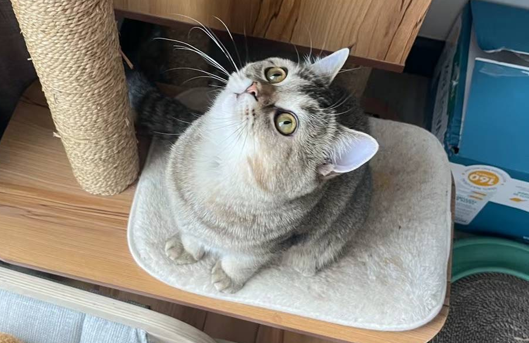

# Hi there! 👋 I'm Cara Ren

I'm a 3rd-year **Computing and Financial Management** student at the **University of Waterloo** with a passion for technology, finance, and making impactful contributions through software development. I've had the opportunity to work with amazing teams at **Sun Life**, **LTIMindtree**, and **Innocuous AI** as a software developer, gaining hands-on experience in real-world projects.

I'm currently **seeking Summer 2025 internship opportunities** in software development, or related fields. I love tackling complex challenges and contributing to projects that drive meaningful change.

---

### 🌟 A bit about me:
- 💻 **Software Development Experience**: Experienced with full-stack and backend development.
- 📸 **Hobbies**: Outside of coding, I love **photography**, **dancing**, and spending time with my **super cute British Shorthair cat**, who has beautiful gold fur.
  
---

### 📫 Get in Touch
I'm always open to connecting, so feel free to reach out!  
📧 **Email**: jren@uwaterloo.ca

---

Thanks for visiting, and I look forward to connecting!

